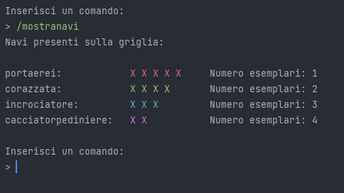
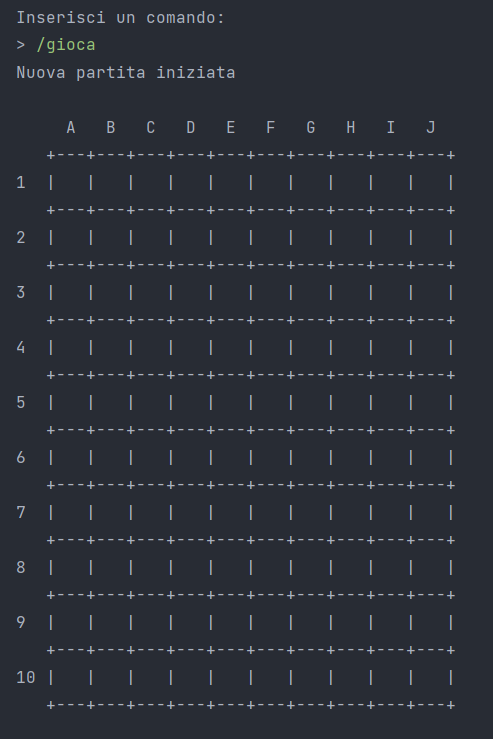
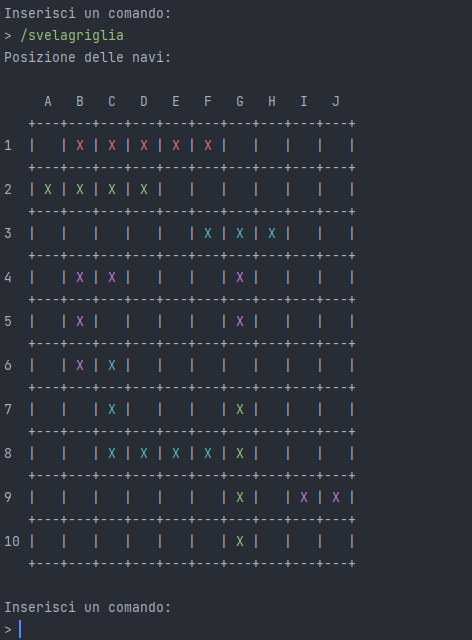

# Report
## Indice
- [1. Introduzione](#1-introduzione)
- [2. Modello di dominio](#2-modello-di-dominio)
- [3. Requisiti specifici](#3-requisiti-specifici)
    - [3.1 Requisiti funzionali](#31-requisiti-funzionali)
    - [3.2 Requisiti non funzionali](#32-requisiti-non-funzionali)
- [7. Manuale Utente](#7-manuale-utente)
- [8. Processo di sviluppo e organizzazione del lavoro](#8-Processo-di-sviluppo-e-organizzazione-del-lavoro)
- [9. Analisi retrospettiva](#9-analisi-retrospettiva)
    - [9.1 Sprint 0](#91-sprint-0)
    - [9.2 Sprint 1](#92-sprint-1)


## 1. Introduzione

### Introduzione al progetto

Il progetto del gioco della **battaglia navale** è stato avviato al fine di creare un'applicazione interattiva da terminale basata sul gioco da tavolo. 
Il gioco della battaglia navale è un **gioco strategico** nel quale ogni giocatore cerca di individuare e affondare le navi nemiche posizionate su una griglia. 
In questo progetto si considera una **versione a giocatore singolo** del gioco, in cui il giocatore attacca una griglia virtuale generata dall'applicazione.

### Scopi del progetto

- Creare un'applicazione interattiva che consenta agli utenti di giocare al gioco della battaglia Navale in versione a singolo giocatore con diversi livelli di difficoltà.

- Garantire la stabilità e la fluidità del gioco, evitando bug e problemi tecnici che potrebbero compromettere l'esperienza di gioco.

- Offrire una documentazione tecnica completa per consentire agli utenti di utilizzare l'applicazione e comprenderne il funzionamento interno.

### Pianificazione

La pianificazione del progetto prevede l'adozione di una metodologia di **sviluppo agile**, con una suddivisione delle attività in 3 sprint.

È stato adottato **GitHub** come software di controllo versione per collaborare, tenere traccia delle modifiche al codice dell'applicazione e assegnare compiti ai membri del gruppo.

Si è deciso di utilizzare **Java** come linguaggio di programmazione, **Gradle** per gestire le dipendenze e altri strumenti di sviluppo moderni come Checkstyle e PMD.

#### Metodologia Agile

Il team di sviluppo segue cicli iterativi e incrementali, detti sprint, della durata di circa 2 settimane, durante i quali vengono sviluppate le varie funzionalità dell'applicazione.

### Membri del team

- Marzia Capuano
- Fabio Cirullo
- Simone Columpsi
- Valerio Di Maggio 
- Daniele Gentile

<br>

## 2. Modello di dominio


### Concetti

- **Cella**

    Singola cella all'interno della griglia di gioco.

    - Attributi
        - **colpita**: boolean
            
            Indica se la cella è stata colpita da un attacco del giocatore.
<br><br>

- **CellaPiena**

    Specializzazione di Cella. Rappresenta una cella che è stata occupata da una nave.
<br><br>

- **Griglia**

    Griglia di gioco. È composta da una tabella 10x10 di celle.
<br><br>

- **Nave**

    Nave che occupa due o più celle piene sulla griglia.
    
    - Attributi

        - **tipologia**: string

            Tipo di nave. Può essere una delle seguenti:
            - portaerei
            - corazzata
            - incrociatore
            - cacciatorpediniere

        - **celleRimanenti**: int
            
            Numero di celle non ancora colpite della nave.
<br><br>

- **Partita**

    Partita del gioco. Contiene le navi posizionate e la griglia di gioco.

    - Attributi

        - **livello**: string

            Livello di difficoltà della partita. Può essere uno dei seguenti:
            - facile
            - medio
            - difficile

        - **tentativiRimasti**: int
                
            Numero di tentativi rimasti prima della sconfitta.
<br><br>

- **Comando**

    Comando con cui l'utente gestisce la partita.

    - Attributi

        - **nome**: string

            Nome del comando. Corrisponde alla stringa che l'utente deve inserire per eseguirlo.
        
        - **categoria**: string

            Categoria a cui appartiene il comando.
<br><br>

## 3. Requisiti specifici

### 3.1 Requisiti funzionali

- **RF1**: Come giocatore voglio mostrare l'help con l'elenco dei comandi.

    **Criteri di accettazione**

    Al comando **/help** o invocando l'app con flag **--help** o **-h**

    Il risultato è una descrizione concisa, che normalmente appare all'avvio del programma, seguita dalla lista di comandi disponibili, uno per riga, come da esempio:
    - gioca
    - esci
    - ...<br /><br />
- **RF2**: Come giocatore voglio chiudere il gioco.

    **Criteri di accettazione**

    Al comando **/esci**

    L'applicazione chiede conferma:
    - se la conferma è positiva, l'applicazione si chiude restituendo il controllo al sistema operativo
    - se la risposta è negativa, l'applicazione si predispone a ricevere nuovi tentativi o comandi<br /><br />
- **RF3**: Come giocatore voglio impostare il livello di gioco per variare il numero massimo di tentativi sbagliati.

    **Criteri di accettazione**

    - Al comando **/facile**

    L'applicazione risponde con OK e imposta a 50 il numero massimo di tentativi falliti
    - Al comando **/medio**

    L'applicazione risponde con OK e imposta a 30 il numero massimo di tentativi falliti
    - Al comando **/difficile**

    L'applicazione risponde con OK e imposta a 10 il numero massimo di tentativi falliti<br /><br />
- **RF4**: Come giocatore voglio mostrare il livello di gioco e il numero massimo di tentativi falliti.

    **Criteri di accettazione**

    Al comando **/mostralivello**

    L'applicazione risponde visualizzando il livello di gioco e il numero massimo di tentativi falliti<br /><br />
- **RF5**: Come giocatore voglio visualizzare i tipi di nave e il numero.

    **Criteri di accettazione**

    Al comando **/mostranavi**

    L'applicazione risponde visualizzando, per ogni tipo di nave, la dimensione in quadrati e il numero di esemplari da affondare:
    <table><tr>
    <td style="border: none">- Cacciatorpediniere<br />- Incrociatore<br />- Corazzata<br />- Portaerei</td>
    <td style="border: none">⊠⊠<br />⊠⊠⊠<br />⊠⊠⊠⊠<br />⊠⊠⊠⊠⊠</td>
    <td style="border: none">esemplari: 4<br />esemplari: 3<br />esemplari: 2<br />esemplari: 1</td>
    </tr></table><br />
- **RF6**: Come giocatore voglio iniziare una nuova partita.

    **Criteri di accettazione**

    Al comando **/gioca**

    Se nessuna partita è in corso, l'applicazione imposta casualmente le navi, in orizzontale o in verticale, mostra la griglia vuota e si predispone a ricevere il primo tentativo o altri comandi<br /><br />
- **RF7**: Come giocatore voglio svelare la griglia con le navi posizionate.

    **Criteri di accettazione**

    Al comando **/svelagriglia**

    L'applicazione risponde visualizzando una griglia 10 x 10 con le righe numerate da 1 a 10 e le colonne numerate da A a J e tutte le navi posizionate<br /><br />

### 3.2 Requisiti non funzionali

- **RNF1**: Il container docker dell'app deve essere eseguito da terminali che supportano Unicode con encoding UTF-8 o UTF-16.

    **Elenco di terminali supportati**

    Linux:
    - terminal

    Windows:
    - Powershell
    - Git Bash (in questo caso il comando Docker ha come prefisso winpty; es: winpty docker -it ...)
    
    **Comando per l'esecuzione del container**

    Dopo aver eseguito il comando docker pull copiandolo da GitHub Packages, il comando Docker da usare per eseguire il container contenente l'applicazione è:

    ```console
    docker run --rm -it ghcr.io/softeng2223-inf-uniba/battleship-base2223:latest
    ```
    <br />
- **RNF2**: Il gioco deve offrire un'interfaccia utente intuitiva e facile da usare. (Usabilità)<br /><br />
- **RNF3**: Il gioco deve gestire errori e ogni tipo di situazione in modo da non provocare interruzioni o crash. (Affidabilità)<br /><br />
- **RNF4**: Il gioco deve essere sviluppato in maniera tale da garantire l'aggiunta di nuove funzionalità o miglioramenti senza modificare l'intero codice. (Manutenibilità)<br /><br />
- **RNF5**: Il gioco deve garantire prestazioni ottime in termini di utilizzo di memoria e latenza. (Efficienza)<br /><br />


## 7. Manuale utente
Questo manuale utente fornirà al giocatore le informazioni necessarie per giocare.
### Comandi Disponibili
Il giocatore può utilizzare una serie di comandi utili per impostare e avere informazioni relative al gioco.
#### Comando /help
Si utilizza per visualizzare l'elenco dei comandi disponibili, uno per riga, per esempio:
- gioca
- esci
- ...
- per esempio:


#### Comando /esci
Per chiudere il gioco, il giocatore, può utilizzare il comando /esci. L'applicazione richiederà una conferma per procedere. Se il giocatore conferma la chiusura, l'applicazione si chiuderà e il controllo verrà restituito al sistema operativo. Se il giocatore nega la chiusura, l'applicazione sarà pronta a ricevere nuovi tentativi o comandi.


### Impostazione del livello di gioco
Il giocatore, prima dell'inizio della partita, può decidere con quale difficoltà giocare, oppure può impostare una difficoltà personalizzata. Le tre difficoltà disponibili sono: facile, medio e difficile. Per selezionare la difficoltà si usa il comando /facile, /medio o /difficile.
Di default la difficoltà è impostata a medio.
È possibile modificare il numero massimo di tentativi falliti per ogni difficoltà utilizzando i comandi /facile [numero], /medio [numero] o /difficile [numero].
È possibile inoltre tramite il comando /tentativi \<numero\> impostare il numero massimo di tentativi falliti senza specificarne la difficoltà.

##### Comando /facile
Il gioco risponderà con "OK" e imposterà il numero massimo di tentativi falliti a 50.


#### Comando /facile [numero]
Il gioco risponderà con "OK" e imposterà il numero massimo di tentativi falliti della difficoltà facile al valore specificato dall'utente.
Il comando non imposta la difficoltà corrente a facile.


##### Comando /medio 
Il gioco risponderà con "OK" e imposterà il numero massimo di tentativi falliti a 30.


##### Comando /medio [numero]
Il gioco risponderà con "OK" e imposterà il numero massimo di tentativi falliti della difficoltà medio al valore specificato dall'utente.
Il comando non imposta la difficoltà corrente a medio.


##### Comando /difficile
Il gioco risponderà con "OK" e imposterà il numero massimo di tentativi falliti a 10.


#### Comando /difficile [numero]
Il gioco risponderà con "OK" e imposterà il numero massimo di tentativi falliti della difficoltà difficile al valore specificato dall'utente.
Il comando non imposta la difficoltà corrente a difficile.


#### Comando /tentativi \<numero\>
Il gioco risponderà con "OK" e imposterà il numero massimo di tentativi falliti al valore specificato dall'utente creando una nuova difficotlà temporanea personalizzata.


#### Comando /mostralivello
Il giocatore può visualizzare il livello di gioco corrente e il numero massimo di tentativi falliti utilizzando il comando /mostralivello. Il gioco risponderà mostrando queste informazioni.


#### Comando /mostranavi
Per conoscere i tipi di nave presenti nel gioco e il numero di esemplari da affondare per ciascun tipo, il giocatore può utilizzare il comando /mostranavi.




#### Comando /gioca
Per iniziare una nuova partita, il giocatore può utilizzare il comando /gioca. Se non è in corso alcuna partita, il gioco imposterà casualmente le navi in posizione orizzontale o verticale, mostrerà la griglia vuota e sarà pronta a ricevere il primo tentativo del giocatore o altri comandi.
Inoltre il gioco registrerà il tempo di inizio della partita per calcolare il tempo trascorso di gioco dopo ogni attacco.




#### Comando /svelagriglia
Utilizzando il comando /svelagriglia il gioco risponde visualizzando, una griglia 10 x 10, con le righe numerate da 1 a 10 e le colonne numerate da A a J, e tutte le navi posizionate.
La griglia può variare di dimensione in base alla scelta del giocatore prima di iniziare la partita.




#### Comando /abbandona
Quando il giocatore usa il comando /abbandona, il gioco chiede conferma all'utente:

- se la conferma è positiva, il gioco svela la posizione di tutte le navi e si predispone a ricevere nuovi comandi;
- altrimenti, il gioco si predispone a ricevere nuovi tentativi o comandi senza abbandonare la partita.


#### Comando /standard
Il giocatore può utilizzare il comando /standard per impostare la grandezza della griglia a 10x10.


#### Comando /large
Il giocatore può utilizzare il comando /large per impostare la grandezza della griglia a 18x18.


#### Comando /extralarge
Il giocatore può utilizzare il comando /extralarge per impostare la grandezza della griglia a 26x26.


## Comando /mostragriglia
Il giocatore può utilizzare il comando /mostragriglia per visualizzare la griglia di gioco nel quale si possono vedere le navi colpite, le navi affondate e i colpi andati in mare.
Se la nave è affondata risulterà colorata con il colore che identifica la tipologia di nave.
Se la nave non è affondata invece risulterà del colore di base del testo del terminale utilizzato.
Se il colpo è andato in mare la casella sarà occupata dal simbolo ~.


### Introduzione di gioco
La **battaglia navale** è un gioco, in questo caso a giocatore singolo, il cui **obiettivo** è quello di **affondare tutte le navi** che sono posizionate su una griglia 10x10 nascosta al giocatore con le righe numerate da 1 a 10 e le colonne numerate da A a J.
### Regole
Prima di iniziare, il giocatore può impostare un **livello di gioco**: **facile**, **medio** o **difficile**; Ognuno di questi livelli ha un numero massimo di tentativi falliti, il livello facile offre un numero di tentativi falliti pari a 50, il livello medio ne offre 30 e il livello difficile ne offre 10.
### Fase iniziale
Le navi saranno posizionate segretamente sulla griglia in maniera casuale dal programma. Ogni nave può essere posizionata orizzontalmente o verticalmente, non in diagonale. Inoltre le navi possono toccarsi, ma non possono occupare le stesse celle. La posizione delle navi non potrà essere modificata dopo l'inizio del gioco.
#### Tipi di nave
Le tipologie di navi si distinguono in base alla dimensione: 
- Cacciatorpediniere 	⊠⊠ 		esemplari: 4 

- Incrociatore 		⊠⊠⊠ 	esemplari: 3  

- Corazzata 		⊠⊠⊠⊠ 	esemplari: 2  

- Portaerei  		⊠⊠⊠⊠⊠ 	esemplari: 1 

### Fase di gioco
Dopo aver selezionato il livello di gioco e posizionato le navi, il giocatore sceglie una cella identificata da una lettera e un numero sulla griglia in cui il colpo sarà lanciato.
Il giocatore ha a disposizione 1 colpo per tentativo.
Il programma controlla se, nella cella scelta sulla griglia dal giocatore, è stata posizionata una nave e in tal caso si visualizzerà il simbolo: x, altrimenti se la cella non contiene una nave si visualizzerà il simbolo: ~ che indica la cella vuota. Quando la nave viene affondata il simbolo varia per ogni tipo di nave.
### Fase finale
In conclusione il gioco termina con una vittoria, quando il giocatore affonda tutte le navi, oppure con una sconfitta, quando il giocatore termina il numero massimo di tentativi falliti.
<br>
### Esecuzione dell'applicazione
Il container docker dell'app deve essere eseguito da terminali che supportano Unicode con encoding UTF-8 o UTF-16.
#### Elenco di terminali supportati

Linux:
- terminal

Windows:
- Powershell
- Git Bash (in questo caso il comando Docker ha come prefisso winpty; es: winpty docker -it ...)

#### Comando per l'esecuzione del container
Dopo aver eseguito il comando ```docker pull``` copiandolo da GitHub Packages, il comando Docker da usare per eseguire il container contenente l'applicazione è:
```docker run --rm -it ghcr.io/softeng2223-inf-uniba/battleship-hamming:latest```

## 8. Processo di sviluppo e organizzazione del lavoro
Il gruppo Hamming, durante lo svolgimento delle consegne ha perseguito una strategia precisa nell'organizzazione e nella divisione del lavoro, tale framework di gestione è denominato "Scrum".
#### Organizzazione del lavoro
I progetti Scrum fanno progressi in una serie di iterazioni dette sprint, non interrompibili, con una durata, in questo caso, di 2 settimane. 
In questo progetto precisamente il gruppo ha lavorato su 3 sprint: sprint0, sprint1, sprint2, per ognuno dei quali i requisiti sono stati: analizzati, progettati, realizzati e testati.
Per l'organizzazione di lavoro il gruppo ha utilizzato varie piattaforme di comunicazione come: whatsapp, per fissare daily meeting o per avvisi extra di lavoro e discord utilizzato, come alternativa, per condurre daily meeting straordinari quando non vi era la possibilità di effettuarlo fisicamente.


Inoltre, il gruppo si è impegnato a tenere circa tre daily meeting settimanali per analizzare le modifiche apportate da ciascun membro e valutare eventuali cambiamenti da apportare al progetto. In particolare, si è posta maggiore attenzione sull'individuazione degli aspetti che esigevano miglioramenti.
Organizzazione daily meeting dello Sprint2:


Al termine di ogni sprint, è stata condotta un'analisi retrospettiva tra i membri del gruppo. Questa sessione, di solito della durata di 15-30 minuti, ha fornito a ciascun membro l'opportunità di esprimere un feedback sul lavoro svolto, identificando ciò che è stato fatto correttamente e ciò che è necessario evitare per gli sprint successivi.

#### Processo di sviluppo
##### Fase iniziale
Per ogni sprint, è stata assegnata una lista di user story, ciascuna delle quali rappresenta un lavoro distinto necessario per il completamento del progetto. Queste user story sono state stabilite dal Product Owner, ovvero il responsabile esclusivo della gestione del Product Backlog. Il Product Owner prende decisioni riguardo all'accettazione o al rifiuto dei risultati del lavoro del team di sviluppo e stabilisce la data di scadenza di ciascuno sprint.

##### Fase intermedia
Il gruppo ha implementato le user story selezionate dal product backlog per lo sprint. Ogni user story è stata assegnata a uno o due membri del team di sviluppo, la cui gestione è dipesa da loro.   

##### Fase finale
Nella fase conclusiva è stata condotta una riunione, svolta dopo la consegna di ogni sprint. La sua finalità principale è stata quella di ottenere il feedback dal product owner.

#### Strumenti utilizzati
Durante la fase di sviluppo del progetto è stato utilizzato il sistema di versionamento Git, in particolare il modello di branching GitHub Flow.
Per ognuno dei tre sprint è stato creato una milestone, chiamato con il nome del relativo sprint, a cui sono state assegnate tutte le issues e la project board associati allo sprint in corso.

La project board di ogni sprint prevedeva le seguenti colonne:
- **To Do**: relativa agli incarichi assegnati, ma il cui lavoro non è ancora iniziato;
- **In Progress**, per le attività in corso di svolgimento;
- **Review**, per le attività completate e in attesa di revisione prima del merge;
- **Ready**, per le attività completate e pronte per essere integrate nel branch principale;
- **Done**, relativa alle modifiche revisionate dal Product Owner.


I requisti funzionali sono stati assegnati a uno o più membri del gruppo, con una data di scadenza specificata. Nel caso di compiti assegnati a più persone è stata lasciata libertà
di autogestione per la suddivisione del lavoro. Successivamente, sono state aperte le issue relative a ciascun compito assegnato.

Ogni membro ha creato un branch sul proprio repository locale, corrispondente alle issue assegnate, per lavorare in modo indipendente
e mantenere le modifiche localmente prima di aggiornare il branch remoto.

Dopo aver completato il proprio compito e inviato una pull request, è stato chiesto che almeno un membro del gruppo
confermasse e approvasse le modifiche prima del merge e della cancellazione del branch. Di solito, per modifiche minori o che non avrebbero creato conflitti,
la revisione di un solo membro è stata sufficiente, mentre per modifiche più significative si è cercato di ottenere più pareri 
per garantire maggiore cautela e sicurezza nella correttezza del lavoro svolto. In alcuni casi, la revisione ha richiesto ulteriori modifiche prima
dell'approvazione delle pull request.

Durante la realizzazione del progetto, come ambiente di sviluppo, è stato usato l'IDE Visual Studio Code insieme ad altri software:
- Docker per l'utilizzo di container;
- IntelliJ come IDE secondario;
- Lucidchart e StarUML per la creazione di diagrammi UML;
- Microsoft WhiteBoard per il modello Retrospettiva "Arrabbiato, Triste, Felice"

## 9. Analisi retrospettiva

### 9.1 Sprint 0
**Data:** 3 aprile 2023 - 14 aprile 2023 -- **Revisione**: 26 aprile 2023


**Partecipanti:**
- Marzia Capuano
- Fabio Cirullo
- Simone Columpsi
- Valerio Di Maggio
- Daniele Gentile

**Obiettivo dello Sprint:** dimostrare familiarità con Git, Github Flow e il processo agile tramite delle modifiche richieste dal docente da attuare sulla repository.

Cosa **è andato bene**:
- Il team ha lavorato collaborando, nessuno ha esitato a chiedere aiuto agli altri membri del team qualora ce ne fosse stato il bisogno.
- Il team è riuscito a consegnare ciò che era stato richiesto nel tempo previsto.
- Non sono stati segnalati dei difetti maggiori durante la revisione del progetto.

Cosa **può essere migliorato**:
- I membri del team sono consapevoli che lavorare in pochi giorni è peggio che lavorare di meno ogni giorno per tutta la durata dello Sprint, suddividendo il lavoro nel tempo a disposizione.

Cosa **non è andato bene**:
- Abbiamo riscontrato un problema durante delle modifiche alle impostazioni di Github riguardo la visibilità della Repository assegnata al team. Questo ha richiesto un intervento da parte del Professore e dei Dottorandi.

Possibili azioni per la **correzione dei problemi**:
- Organizzare dei brevi meeting quasi ogni giorno per organizzare al meglio lo sviluppo del progetto.

**Conclusioni:**
Nonostante ci siano stati problemi di tempo derivati dai vari impegni dei partecipanti del team, e qualche problema fortunatamente risolto grazie all'aiuto del docente e dei dottorandi, lo **Sprint 0** è finito senza intoppi, con un progetto consegnato in tempo e senza difetti maggiori. Bisogna lavorare di più sull'organizzazione del tempo per evitare di trovarsi a lavorare molto durante le ultime giornate prima della consegna.

### 9.2 Sprint 1
**Data:** 3 Maggio 2023 - 19 Maggio 2023 -- **Revisione**: 31 Maggio 2023


**Partecipanti:**
- Marzia Capuano
- Fabio Cirullo
- Simone Columpsi
- Valerio Di Maggio
- Daniele Gentile

**Obiettivo dello Sprint**: implementare alcuni dei comandi utilizzabili a partita non iniziata come la possibiltà di scegliere la difficoltà, vedere quali tipologie di nave ci sono ed il loro numero nel tabellone di gioco, l'help dei comandi, e alcuni comandi utilizzabili a partita in corso, come la possibilità di vedere dove sono state posizionate le navi.

Cosa **è andato bene**:
- Il team ha consegnato in tempo ciò che era stato richiesto di sviluppare.
- Nessuno del team si è rifiutato di aiutare chi ne aveva bisogno, fornendo consigli su come poter risolvere un determinato problema.
- Non sono stati segnalati difetti maggiori nella Revisione dello sprint.

Cosa **può essere migliorato**:
- Ci sono stati dei ritardi per quanto riguarda l'inizio dello sprint da parte del gruppo, risultando in una mole di lavoro più ampia durante gli ultimi giorni prima della chiusura della consegna.

Cosa **non è andato bene**:
- La consegna è stata effettuata a solo 1h di anticipo dalla chiusura.
- In generale dati i problemi di tempo riscontrati nello sprint non è stata prestata attenzione ad alcuni dettagli che nella revisione sono stati segnalati come difetti minori.

Possibili azioni per la **correzione dei problemi**:
- Iniziare quanto prima l'assegnazione delle prime user story ai membri del gruppo.
- Rispettare delle scadenze per quanto riguarda degli aspetti essenziali per proseguire nello sviluppo del programma evitando dei conflitti che possano causare più problemi del dovuto.

**Conclusioni**:
Non sono stati fatti degli effettivi miglioramenti per quanto rigurda la gestione del tempo a disposizione da parte del team, fortunatamente però è stato consegnato tutto in tempo, anche se con qualche difetto riscontrato successivamente nella revisione. Il team si è mostrato quindi più disponibile per lo sprint 2 ad iniziare il prima possibile per poter diminuire la mole di lavoro giornaliera al minimo.
Il team è comunque soddisfatto di non aver ricevuto riscontri su dei difetti maggiori.